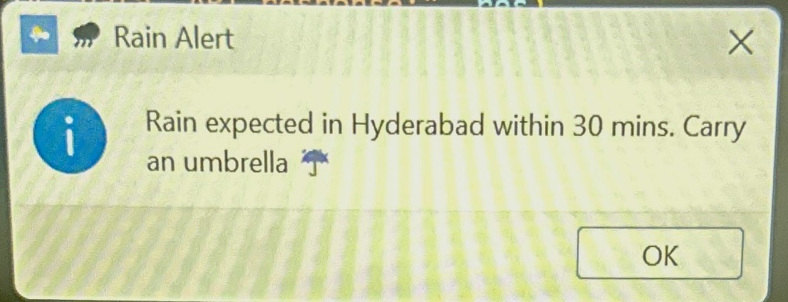
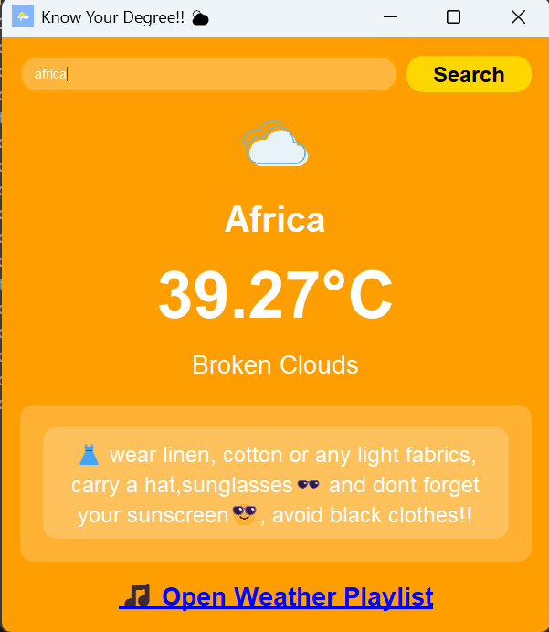

# Smart weather app
## titled: know your degree
A python based weather application with PyQt5 GUI that:
- does real time tracking
- fetches weather of the cities through OpenWeatherMap API
- auto_detection of location using IP Geolocation API
- enables search city manually
- notifies and alerts if there is upcoming wind, rain or sunny conditions
- dynamically change the bg_color and icon according to the weather 
- recommends playlist and clothing recommendations according to the weather conditions

## GUI and window looks this way
- the main window(auto_detects city)
 
- the alerts 

- the dynamic bg_color and icons by searching manually


## features:
1. fetches weather with 
  - city name 
  - temperature 
  - weather condition
  - clothes recommendation 
  - and spotify playlist
2. refreshes automatically every 10minutes and updates the weather accordingly
3. provides you with a search bar to manually search different cities globally
4. provides clothes recommendations according to the weather
 
## Project Structure
```bash
weather-app/
├── icon/
├── screenshots/
│ ├── alerts.png
│ ├── change_and_search.png
│ └── mainwindow.png
├── .env.example
├── .gitignore
├── README.md
├── requirements.txt
├── weather.jpg
└── weatherapp.py
```

## Installation
1. Clone this repository:
   ```bash
   git clone https://github.com/srijaredddybaradi/weather-app.git
   cd weather-app

2. Create virtual environment
   ```bash
   python -m venv venv
   source venv/bin/activate   # On Linux/Mac
   venv\Scripts\activate      # On Windows

4. Install requirements
   ```bash
   pip install -r requirements.txt

6. Add .env file with API keys
   - WEATHER_KEY=your_api_keys(openweathermap)
   - API_KEY=your_api_keys(ip_geolocation)

7. Run the app
   ```bash
   python weatherapp.py

## API Usage
- [OpenWeatherMap OneCall API](https://openweathermap.org/api/one-call-api)
- [ipgeolocation.io API](https://ipgeolocation.io/)

## 🤝 Contributing
Contributions are welcome!  
1. Fork the repo  
2. Create a feature branch  
3. Commit changes  
4. Open a pull request

## 🐞 Find & Report Bugs  
If you spot a bug, please file an Issue first so we can track and discuss it.  
1. Check Issues – make sure the bug/feature isn’t already reported.  
2. File a New Issue – describe the problem or feature request.   
4. Fork & Fix  
5. Open a Pull Request (PR)

## 📜 License
This project is licensed under the MIT License.
